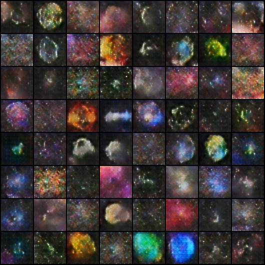

# SpaceGAN

A DCGAN that generates imaginative celestial objects. 

I used many images from NASA's Astronomy Picture of the Day Archive for training this model.

Currently, epoch 197 is my favorite:

