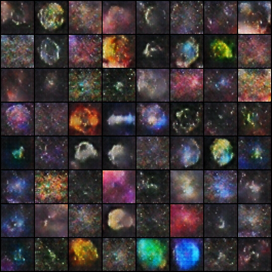
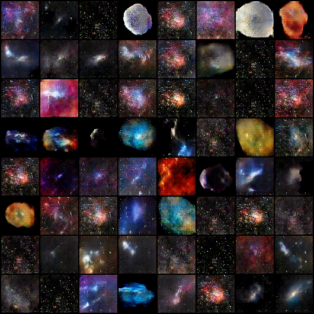
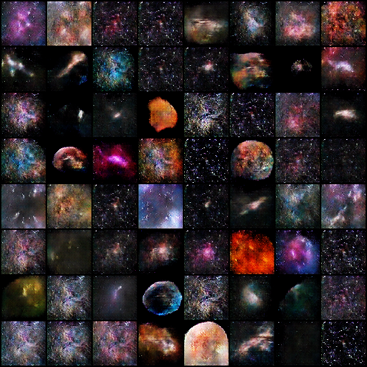
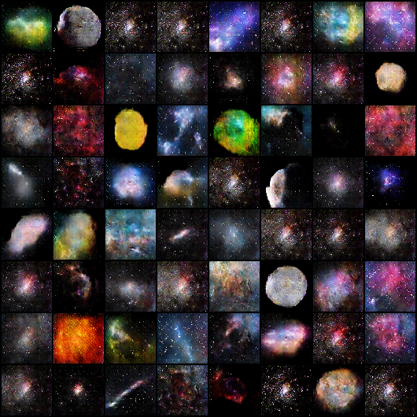

# SpaceGAN

A DCGAN that generates imaginative celestial objects. 

I used over 2000 images from NASA's Astronomy Picture of the Day Archive for training this model.

Some of my favorite samples:

